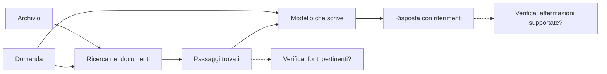

# Primo incontro — cercare prima di rispondere

Materiale pronto per Sol, **non ancora discusso con Andrea**. Fermarsi tra i passaggi e usare le sue risposte per scegliere il ritmo.

## Il punto di partenza

Immagina di avere un archivio di documenti finanziari. Una persona fa una domanda. La risposta può essere già nell'archivio, ma non sappiamo in quale testo si trovi, e la domanda può usare parole diverse. Vogliamo prima trovare le informazioni utili e poi, se serve, farle spiegare da un modello.

Tre documenti inventati, relativi a un servizio immaginario; condizioni e numeri non descrivono prodotti reali:

- **D1:** «L'attivazione del conto Aurora non prevede una commissione iniziale.»
- **D2:** «Per ogni prelievo con la carta Aurora viene applicata una commissione di due euro.»
- **D3:** «Il conto Nebbia applica una commissione iniziale di dieci euro.»

Domanda: **«Quanto spendo per aprire Aurora?»**

Per Sol: chiedere quale documento userebbe Andrea, e perché. Non presentare subito la soluzione come un quiz risolto. Dopo la risposta, osservare insieme che «spendo per aprire» e «commissione iniziale / attivazione» esprimono un bisogno simile usando parole diverse; condividere soltanto il nome Aurora non basta a scegliere D1 invece di D2.

## Il problema successivo

Con tre documenti possiamo leggere tutto. Con migliaia di passaggi serve un modo per cercare e ordinare i candidati. Un embedding ci aiuterà rappresentando il testo con numeri confrontabili. Quei numeri non sono la risposta e non sono un certificato di verità. Un **vettore** è qui una lista ordinata di numeri; un **embedding** è una rappresentazione di un testo sotto forma di vettore, prodotta da un modello.

Non calcolare ancora distanze se questi ruoli non sono chiari. Al prossimo passo confronteremo esempi reali, senza inventare significati umani per ogni singolo numero: una coordinata non significa necessariamente «finanza» o «costo».

## Dove entra il RAG

Una volta trovato D1, un modello può formulare una risposta e citarlo. Il RAG collega questa ricerca alla generazione della risposta. Aggiornare l'archivio e cercarci dentro non significa riaddestrare il modello.

**Figura didattica schematica, non risultato sperimentale.** La ricerca deve scegliere una fonte; il generatore può comunque interpretarla male. Le due verifiche sono separate.

Questo è l'orizzonte del progetto. La prima parte del lavoro si ferma ai passaggi trovati; il generatore arriva dopo.

## Due esempi per continuare quando Andrea è pronto

- «E prelevare?» dopo la domanda iniziale: cosa manca se leggiamo soltanto questa frase?
- «Qual è il tasso del conto Aurora?» con i soli tre documenti: l'informazione è disponibile? Una frase plausibile sarebbe sufficiente?

Obiettivo del primo incontro: Andrea distingue trovare una fonte, rappresentare un testo per cercarlo e formulare una risposta. Non serve memorizzare formule o sigle. Registrare in HANDOVER ciò che è emerso davvero e la domanda da cui riprendere.
